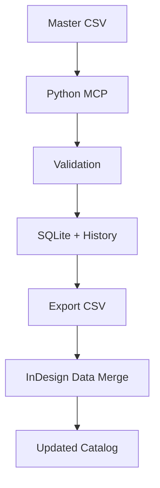

# Process Flow

```mermaid
flowchart TD
    A[Master CSV] --> B[Python MCP]
    B --> C[Validation]
    C --> D[SQLite + History]
    D --> E[Export CSV]
    E --> F[InDesign Data Merge]
    F --> G[Updated Catalog]
```

See the generated image in presentation.